# Regional Slow-Wave Biomarkers of Phenoconversion in Isolated REM Sleep Behavior Disorder

**BrainHack School 2026 Final Project**
**Maya Behlouli**
Center for Advanced Research in Sleep Medicine, Polytechnique Montréal

> Can regional NREM slow-wave sleep biomarkers help predict phenoconversion in isolated REM Sleep Behavior Disorder?

<p align="center">
  
</p>

---

## About Me

I am a Master's student in Neuroengineering with a background in neuroscience. My research focuses on sleep EEG biomarkers in isolated REM Sleep Behavior Disorder (iRBD), with a particular interest in understanding how sleep physiology can help characterize early neurodegenerative risk.

During BrainHack School, my goal was to transition from previous R-based and partially manual workflows toward a reproducible Python-based analysis pipeline using Git, GitHub, Jupyter notebooks, and machine learning tools.

---

## Project Summary

Isolated REM Sleep Behavior Disorder is a prodromal condition strongly associated with future alpha-synucleinopathies such as Parkinson's Disease and Dementia with Lewy Bodies.

Previous studies have shown that iRBD patients who later phenoconvert exhibit alterations in NREM slow-wave sleep characteristics. This project investigates whether regional slow-wave biomarkers can be used not only to describe group differences, but also to support individual-level prediction of phenoconversion.

The final workflow processes pre-extracted sleep EEG features, constructs regional biomarkers, compares converters and non-converters, trains interpretable classifiers, and identifies robust physiological predictors.

---

## Introduction

iRBD is one of the strongest clinical predictors of future alpha-synucleinopathies. However, the timing and subtype of phenoconversion remain highly variable.

This raises an important question: can sleep EEG biomarkers provide early information about future neurodegeneration?

Slow waves during NREM sleep reflect large-scale cortical synchronization. Because neurodegenerative processes may alter cortical physiology before overt clinical symptoms emerge, slow-wave characteristics may serve as promising biomarkers of disease progression.

This project focuses on regional slow-wave biomarkers extracted from N2 and N3 sleep and evaluates whether their spatial organization across the brain improves prediction of phenoconversion.

---

## Main Objectives

1. Build a reproducible Python workflow for slow-wave EEG biomarker analysis.
2. Compare converters and non-converters using repeated-measures ANCOVA.
3. Train an interpretable machine learning classifier to predict conversion status.                      
4. Identify robust slow-wave biomarkers using model coefficients.
5. Explore whether future DLB and Parkinson converters show distinct slow-wave profiles.

---

## Tools
## Tools

One of my main objectives during BrainHack School was to move beyond my original analysis workflow and adopt more reproducible and scalable research practices, for myself in the future, and my peers

Although the scientific questions of this project were already defined, BrainHack provided an opportunity to restructure the entire workflow using open-science tools and computational methods that were new to me. I wanted to develop a complete, reproducible pipeline that could be reused, extended, and shared with other researchers.

To achieve this goal, the project uses the following tools:


* **Git** and **GitHub** for version control and project sharing.
* **Python** for scripting and reproducible analyses.
* **Jupyter Notebooks** for transparent workflows and reporting.
* **pandas** and **NumPy** for data manipulation.
* **statsmodels** for ANCOVA and statistical modeling.
* **scikit-learn** for machine learning classification.
* **matplotlib** for scientific visualization.
* **Markdown** for project documentation.

---

## Data

The dataset used in this project is derived from a longitudinal study conducted at the Center for Advanced Research in Sleep Medicine (CARSM) in Montreal.

Participants underwent a full night of monitored sleep recording alongside standardized neurological and neuropsychological evaluations, including the Unified Parkinson's Disease Rating Scale (UPDRS Parts I and III), the Mini-Mental State Examination (MMSE), and the Montreal Cognitive Assessment (MoCA), allowing the characterization of both motor and cognitive functioning.

All slow-wave detections were performed automatically using the Snooze software and subsequently verified visually to ensure data quality.

Because the analyses presented here rely on previously extracted slow-wave characteristics, the first step of this project consisted of verifying the integrity of the dataset and ensuring that slow-wave variables, electrodes, participant identifiers, and conversion status were correctly defined before building the analysis pipeline.

After preprocessing and participant exclusions, the final dataset included:

| Group             |  N |
| ----------------- | -: |
| Non-converters    | 60 |
| DLB converters    | 20 |
| PD converters     |  9 |
| PD-MCI converters |  8 |

For the exploratory subtype analysis, PD and PD-MCI participants were combined:

| Group     |  N |
| --------- | -: |
| DLB       | 20 |
| Parkinson | 17 |

<p align="center">
  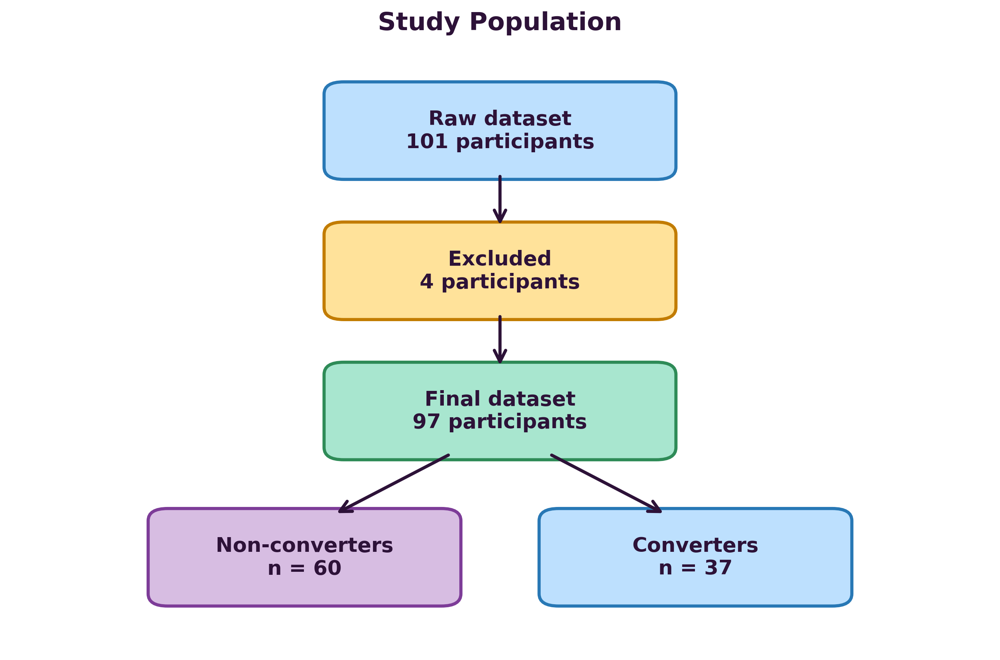
</p>

---

## Data Availability

The clinical data used in this project are not publicly available because they originate from a research cohort and are subject to privacy, ethical, and institutional restrictions.

To protect participant confidentiality, the raw and processed datasets are not included in this public repository.

This repository contains the complete analysis workflow, source code, documentation, and figures required to reproduce the analyses once access to the data has been granted.

Researchers interested in accessing the original data may contact the Center for Advanced Research in Sleep Medicine (CARSM) and the project author to discuss data access requirements and approval.
---

## Regional Feature Construction

Slow-wave features were averaged across homologous left and right electrodes to create four regional biomarkers:

| Region    | Electrodes |
| --------- | ---------- |
| Frontal   | F3 / F4    |
| Central   | C3 / C4    |
| Parietal  | P3 / P4    |
| Occipital | O1 / O2    |

This approach reduces dimensionality while preserving spatial information and allows testing whether conversion risk depends on regional slow-wave organization rather than global averages alone.

<p align="center">
  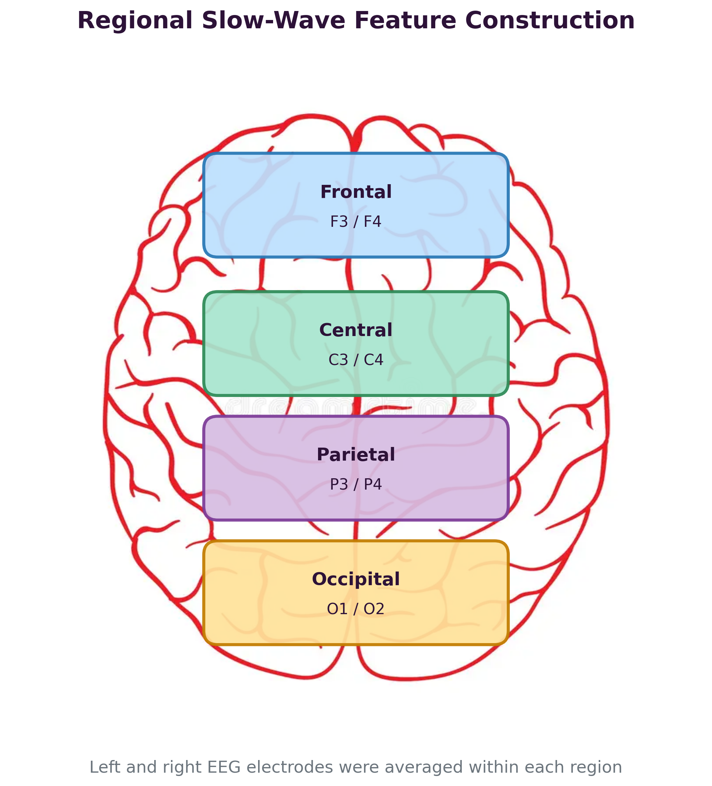
</p>

---

## Analysis Workflow

The workflow was designed to answer the research question at three complementary levels:

1. **Group-level differences** using repeated-measures ANCOVA.
2. **Individual-level prediction** using Linear SVM classification.
3. **Biomarker interpretation** using model coefficients, Logistic Regression, and regional-versus-global comparisons.

<p align="center">
  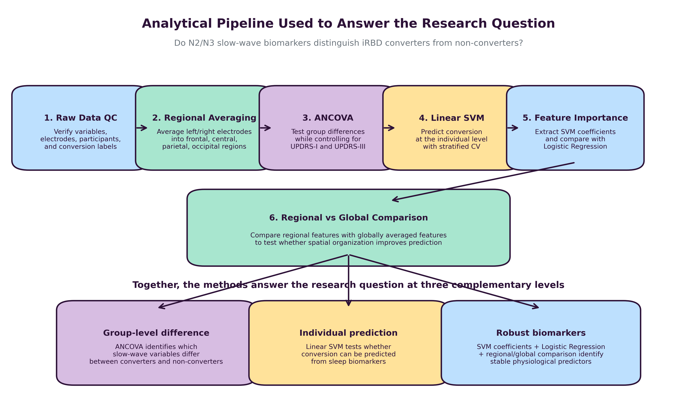
</p>

---

## Project Deliverables

The project includes :

* A reproducible Python workflow for the analysis of regional slow-wave sleep biomarkers in isolated REM Sleep Behavior Disorder (iRBD).
* A statistical framework using repeated-measures ANCOVA to identify slow-wave characteristics associated with future phenoconversion while controlling for clinical covariates.
* An interpretable machine-learning pipeline using Linear SVM to evaluate the predictive value of regional sleep biomarkers and identify the most informative features.
* A comparative analysis of regional versus global biomarker models, as well as an exploratory DLB versus Parkinson subtype investigation.
* A fully documented and version-controlled GitHub repository including reusable scripts, Jupyter notebooks, scientific figures, methodological reports, and presentation materials.

---

## Results

### Converter versus Non-Converter ANCOVA

Repeated-measures ANCOVA identified several slow-wave characteristics that differed significantly between converters and non-converters after controlling for UPDRS-I and UPDRS-III scores.

The strongest group effects involved slow-wave frequency, transition frequency, slope, amplitude, and slow-wave counts.

<p align="center">
  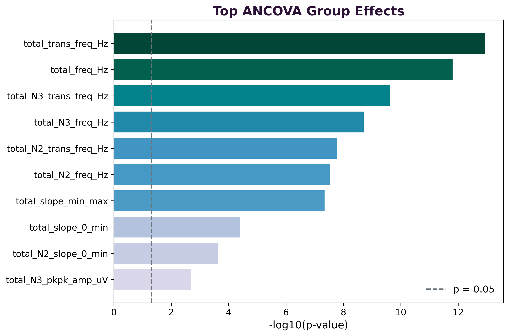
</p>

---

### Machine Learning Classification

A Linear Support Vector Machine classifier was trained to predict conversion status using regional slow-wave biomarkers.

The model used standardized features, stratified cross-validation, and cross-validated predictions.

| Metric            | Value |
| ----------------- | ----: |
| Accuracy          | 0.688 |
| Balanced Accuracy | 0.682 |
| Precision         | 0.607 |
| Recall            | 0.654 |
| F1-score          | 0.630 |
| ROC-AUC           | 0.728 |

<p align="center">
  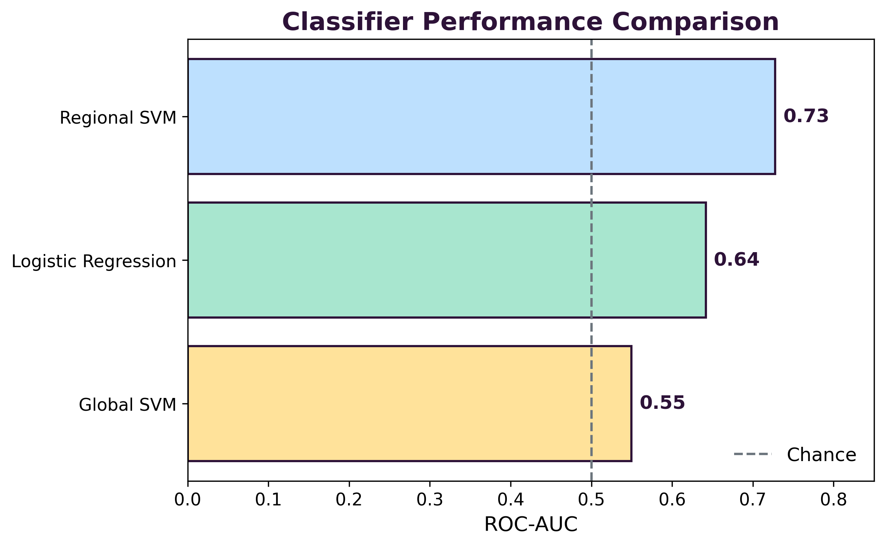
</p>

<p align="center">
  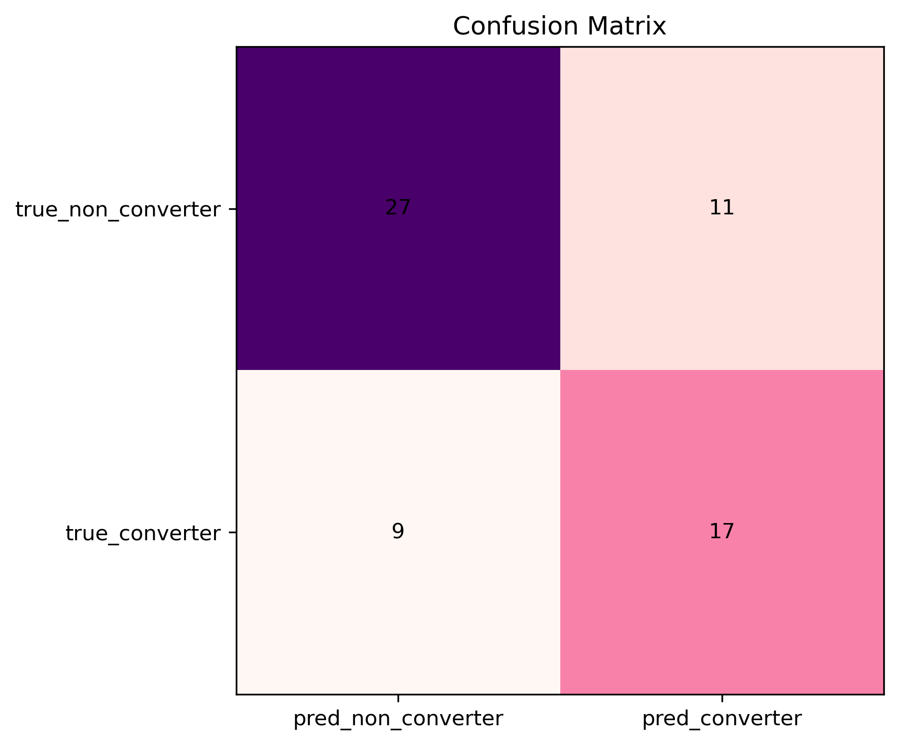
</p>

<p align="center">
  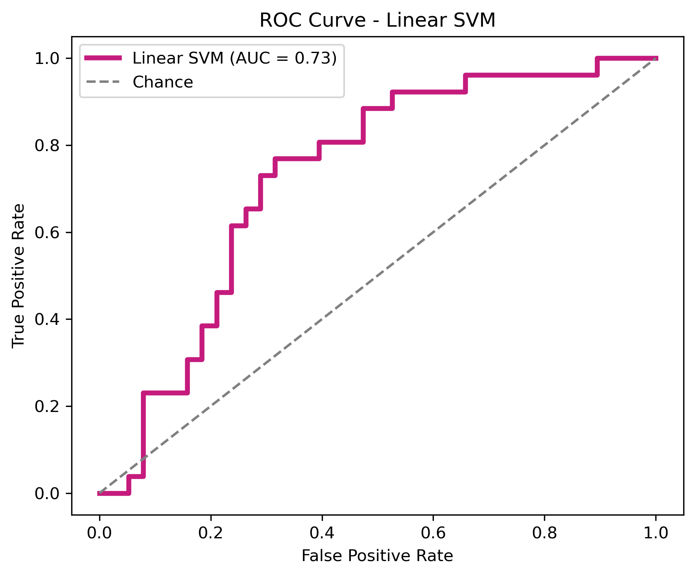
</p>

These results indicate that regional slow-wave biomarkers contain meaningful predictive information regarding future phenoconversion.

---

### Predictive Biomarkers

Feature coefficients extracted from the Linear SVM identified the biomarkers contributing most strongly to classification performance.

The most predictive features included slow-wave amplitude, frequency, transition frequency, slope, and slow-wave counts across frontal, central, parietal, and occipital regions.

<p align="center">
  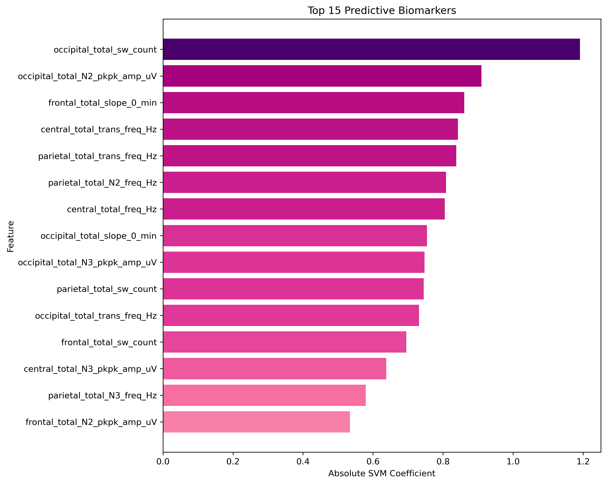
</p>

To evaluate robustness, Logistic Regression was used as a complementary model. Biomarkers identified by both approaches were considered stronger candidates.

<p align="center">
  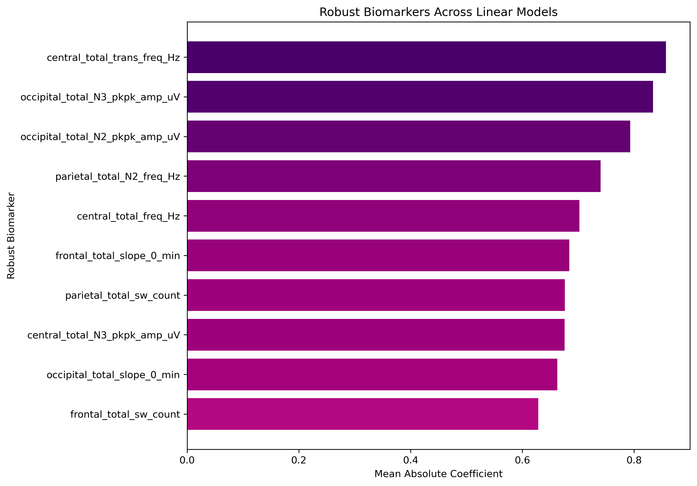
</p>

The final robust biomarkers were also summarized on the regional brain schematic:

<p align="center">
  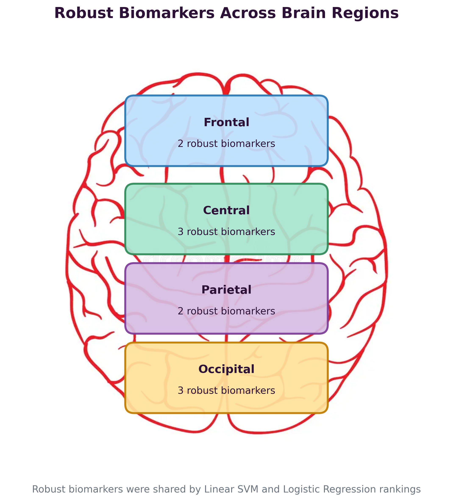
</p>

---

### Regional versus Global Comparison

To determine whether spatial information improves prediction, a second classifier was trained using globally averaged slow-wave features.

| Model               | ROC-AUC |
| ------------------- | ------: |
| Regional Linear SVM |   0.728 |
| Global Linear SVM   |   0.550 |

The regional model substantially outperformed the global model, suggesting that the spatial distribution of slow-wave biomarkers contains important predictive information.

<p align="center">
  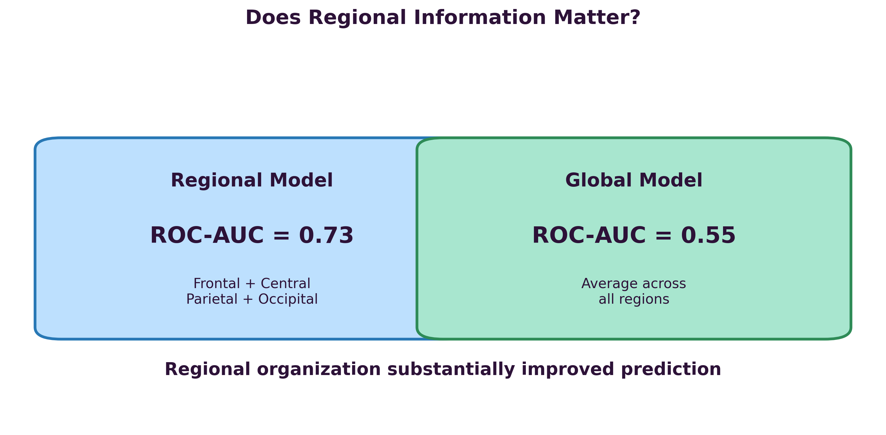
</p>

<p align="center">
  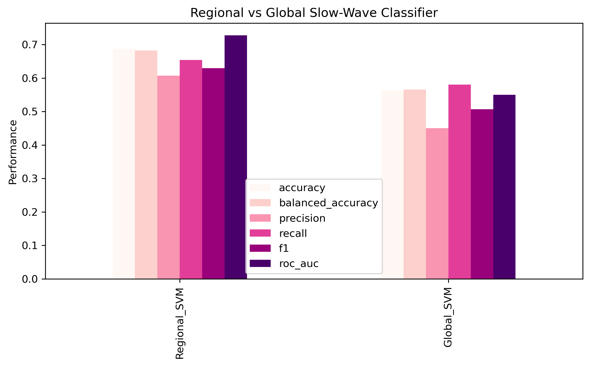
</p>

---

### DLB versus Parkinson Exploratory Analysis

Among converters, an exploratory analysis compared future DLB converters with future Parkinson converters.

No biomarker survived False Discovery Rate correction. However, the strongest candidate effects involved occipital slow-wave amplitude.

| Biomarker                        | Cohen's d |
| -------------------------------- | --------: |
| `occipital_total_N3_pkpk_amp_uV` |     -0.62 |
| `occipital_total_N2_pkpk_amp_uV` |     -0.45 |

Negative effect sizes indicate lower occipital slow-wave amplitude in future DLB converters compared with future Parkinson converters.

<p align="center">
  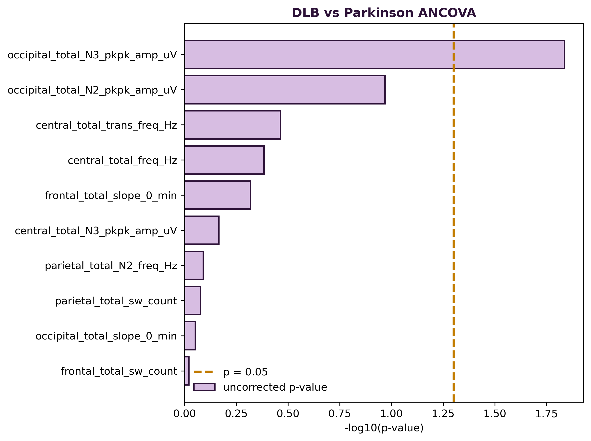
</p>

---

## Conclusions

### Can slow-wave biomarkers predict conversion?

Yes. Regional NREM slow-wave biomarkers contain information associated with future phenoconversion risk in iRBD. The Linear SVM achieved moderate predictive performance with a ROC-AUC of approximately 0.73.

### Does regional information matter?

Yes. Regional models clearly outperformed global models, indicating that spatial organization is an important component of predictive information.

### Which biomarkers appear most relevant?

The most robust biomarkers involved slow-wave amplitude, frequency, transition frequency, slope, and slow-wave counts across frontal, central, parietal, and occipital regions.

### What about DLB versus Parkinson?

The DLB versus Parkinson comparison remains exploratory. Although no biomarker survived FDR correction, occipital N2 and N3 amplitudes showed the largest effect sizes.

### Overall Conclusion

This project supports the hypothesis that sleep EEG biomarkers may help characterize prodromal neurodegeneration in iRBD and highlights the importance of regional slow-wave organization for predicting phenoconversion risk.
Beyond the scientific findings, this project represents a pivotal transition in my research methodology. BrainHack School facilitated a shift from my, manual workflows toward a collaborative paradigm and community-driven standards. 
I have gained technical proficiency in implementing computational pipelines significantly enhancing the efficiency, transparency, and reproducibility of my work. This exposure to professional practices, including modular Python scripting and version control, has  transformed my approach to my future analysis. 

<p align="center">
  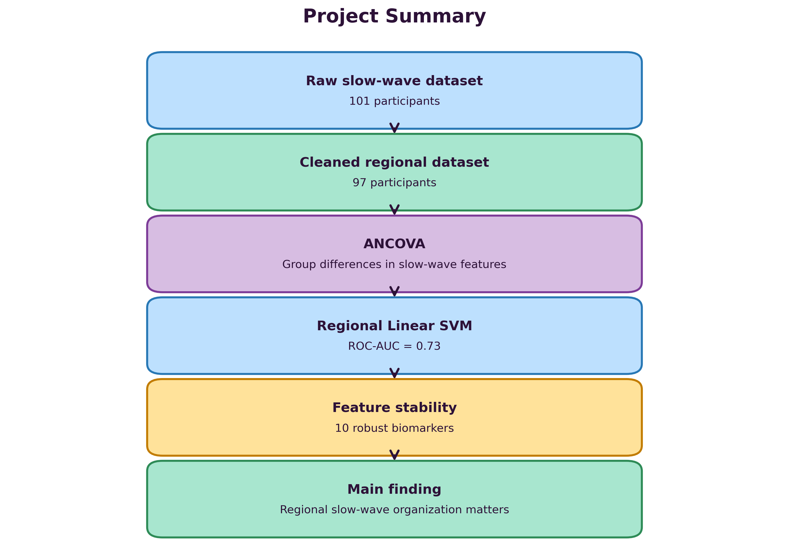
</p>

---

## Guide to Reproducibility

### Clone the Repository

```bash
git clone https://github.com/mayainneuro/RBD_SW_sleep_conversion
cd RBD_SW_sleep_conversion
```

### Create the Environment

```bash
conda env create -f environment.yml
conda activate RBD_SW_sleep_conversion
```

### Run the Main Pipeline

```bash
python src/run_pipeline.py
```

### Run Individual Analyses

Preprocessing and regional feature construction:

```bash
python src/formatchanging.py
```

Repeated-measures ANCOVA:

```bash
python src/repeated_measures_ancova.py
```

Regional machine learning classifier:

```bash
python src/train_classifier.py
```

Global feature classifier:

```bash
python src/train_classifier_global_features.py
```

### Explore Notebooks

Recommended order:

```text
notebooks/01_data_qc.ipynb
notebooks/02_quality_control.ipynb
notebooks/03_machine_learning_results.ipynb
notebooks/04_machine_learning_figures.ipynb
notebooks/05_final_biomarker_summary.ipynb
notebooks/06_presentation_figures.ipynb
notebooks/08_dlb_vs_pd_analysis.ipynb
```

---

## Documentation

| File                           | Description                                          |
| ------------------------------ | ---------------------------------------------------- |
| `docs/data_processing.md`      | Data preprocessing and regional feature construction |
| `docs/statistical_analysis.md` | ANCOVA and statistical methods                       |
| `docs/machine_learning.md`     | Machine learning pipeline                            |
| `docs/dlb_vs_pd_analysis.md`   | DLB versus Parkinson exploratory analysis            |
| `docs/analysis_log.md`         | Summary of completed analyses                        |
| `docs/processing_log.md`       | Processing notes                                     |

---

## Acknowledgements

I would like to thank the BrainHack School team for teaching me and guiding me throught this technical transition and the Center for Advanced Research in Sleep Medicine and my supervisor for their support, mentorship, and feedback throughout this project.

---

## References

### Project Repository

* Behlouli, M. (2026). *RBD_SW_sleep_conversion*. GitHub. https://github.com/mayainneuro/RBD_SW_sleep_conversion

### BrainHack School Modules and Course Material

* Benesch, D., & Kabbabi, A. (2020). *Biosignal processing for automatic emotion recognition*. BrainHack School.
* DuPre, E. (2020). *Introduction to Git and GitHub* [Video]. BrainHack School.
* DuPre, E. (2020). *Standards for project management and organization* [Video]. BrainHack School.
* Markello, R. (2021). *A brief introduction to the bash shell* [Module presented during QLSC612]. BrainHack School.
* Markello, R. (2020). *Python for data analysis* [Video]. BrainHack School.
* Paugam, F. (2020). *Writing scripts in Python module* [Video]. BrainHack School.
* Richards, B. (2020). *Fundamentals of deep learning in neuroscience* [Video]. BrainHack School.
* Vogel, J. (2020). *Applications of deep learning in neuroimaging (Nobrainer)* [Video]. BrainHack School.
* Vogel, J. (2020). *Introduction to machine learning: Part 2, hands-on tutorial* [Video]. BrainHack School.

### Scientific and Technical References

* Bengio, Y., & LeCun, Y. (2007). Scaling learning algorithms towards AI. In *Large-Scale Kernel Machines*.
* Carroll, E. A., et al. (2013). Food and mood: Just-in-time support for emotional eating. *IEEE*.
* Galbiati, A., et al. (2019). The risk of neurodegeneration in REM sleep behavior disorder: A systematic review and meta-analysis of longitudinal studies. *Sleep Medicine Reviews*.
* Giannakakis, G., et al. (2019). Review on psychological stress detection using biosignals. *IEEE Transactions on Affective Computing*.
* Goodfellow, I., Bengio, Y., & Courville, A. (2016). *Deep Learning*. MIT Press.
* Katsigiannis, S., & Ramzan, N. (2017). DREAMER: A database for emotion recognition through EEG and ECG signals. *IEEE Journal of Biomedical and Health Informatics*.
* Massicotte-Marquez, J., et al. (2005). Slow-wave sleep and delta power in rapid eye movement sleep behavior disorder. *Annals of Neurology*.
* Pedregosa, F., et al. (2011). Scikit-learn: Machine Learning in Python. *Journal of Machine Learning Research*.
* Turing, A. M. (1950). Computing machinery and intelligence. *Mind*.
* Wilkinson, M. D., et al. (2016). The FAIR Guiding Principles for scientific data management and stewardship. *Scientific Data*.
* Wolpert, D. H., & Macready, W. G. (1997). No free lunch theorems for optimization. *IEEE Transactions on Evolutionary Computation*.


